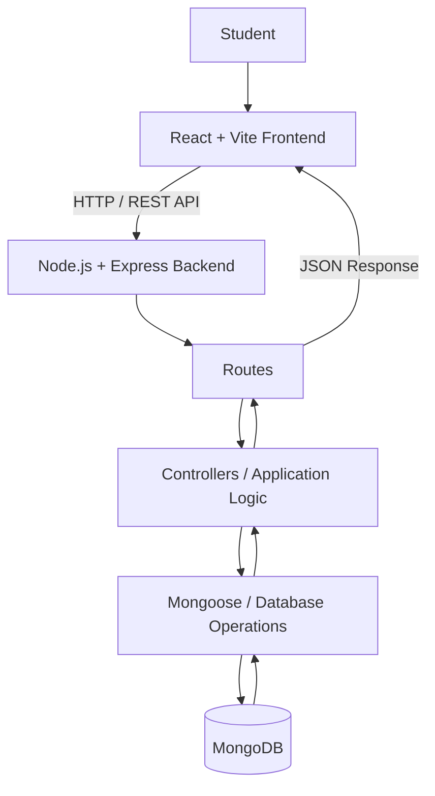
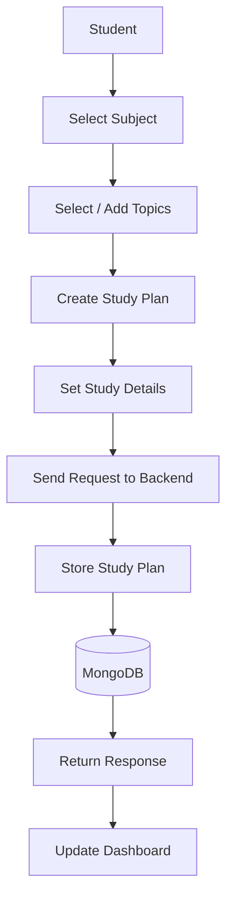
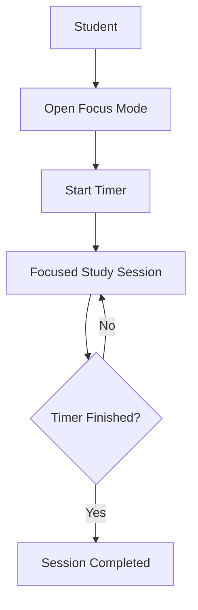
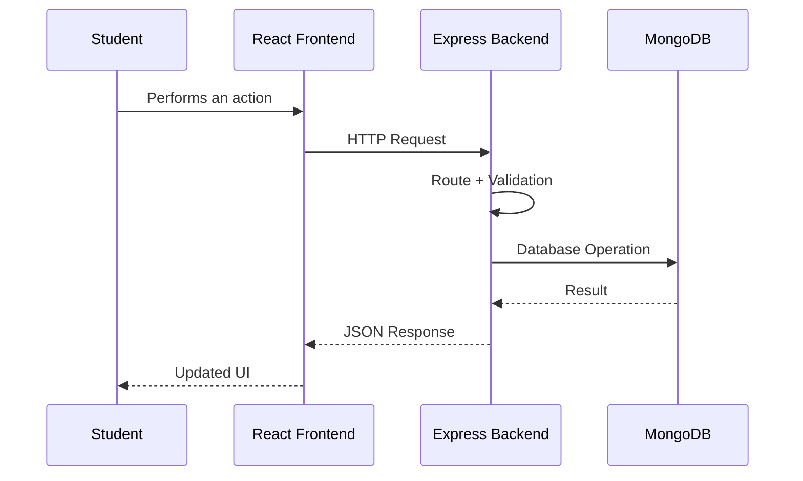

# 📚 StudyOS - Student Productivity Platform

A full-stack student productivity platform built to help students organize
their subjects, topics, study plans, exam dates, schedules, and focused
study sessions in one place.

---

## 📌 Table of Contents

- [Overview](#-overview)
- [Features](#-features)
- [How It Works](#-how-it-works)
- [System Architecture](#-system-architecture)
- [Application Flow](#-application-flow)
- [Study Plan Flow](#-study-plan-flow)
- [Exam & Schedule Flow](#-exam--schedule-flow)
- [Focus Mode](#-focus-mode)
- [Database](#-database)
- [Tech Stack](#-tech-stack)
- [Project Structure](#-project-structure)
- [Installation](#-installation)
- [Environment Variables](#-environment-variables)
- [Future Improvements](#-future-improvements)
- [Author](#-author)

---

## 📖 Overview

StudyOS is a full-stack web application designed around the everyday
academic workflow of a student.

Instead of keeping subjects, topics, exams, and study plans separately,
the application brings them together in one platform.

The application is divided into two main parts:

- **Frontend:** React + Vite
- **Backend:** Node.js + Express

The frontend communicates with the backend through REST APIs, while the
backend handles the application logic and database operations.

---

## ⚡ Features

### 👤 User Management

- User registration
- User login
- Authentication
- User-specific data

### 📚 Subject & Topic Management

- Create subjects
- Add topics under subjects
- Organize academic content
- Manage existing topics

### 📝 Study Plans

- Create study plans
- Assign subjects and topics
- Organize study sessions
- Track planned study work

### 📅 Exam Management

- Add upcoming exams
- Store exam dates
- View upcoming examinations

### ⏰ Schedule

- Organize study activities
- Manage planned sessions
- View academic schedule

### 🎯 Focus Mode

- Start a focused study session
- Timer-based study workflow
- Dedicated distraction-free study mode

---

## 🏗️ System Architecture



---

## 🔄 How It Works

The basic request flow is:

```text
Student
   ↓
React UI
   ↓
User Action
   ↓
API Request
   ↓
Express Backend
   ↓
Route
   ↓
Application Logic
   ↓
MongoDB
   ↓
Response
   ↓
React State
   ↓
Updated UI
```

For example, when a student creates a study plan:

```text
Student fills the form
        ↓
React captures the data
        ↓
Frontend sends API request
        ↓
Express receives request
        ↓
Backend validates the data
        ↓
Study plan is created
        ↓
Data is stored in MongoDB
        ↓
Backend sends response
        ↓
Frontend updates the UI
```

---

# 📚 Study Plan Flow

StudyOS organizes studying around subjects and topics.



The basic relationship is:

```text
Subject
   │
   ├── Topic
   ├── Topic
   └── Topic
        │
        ▼
   Study Plan
        │
        ▼
   Study Session
```

This allows the student to break a larger subject into smaller topics
and plan their study around them.

---

# 📅 Exam & Schedule Flow

Students can add upcoming exams and organize their study activities
around them.

```text
Student
   ↓
Add Exam
   ↓
Enter Exam Information
   ↓
Send Request
   ↓
Backend
   ↓
MongoDB
   ↓
Exam Stored
   ↓
Displayed in Application
```

The schedule works as the planning layer between the student's study
plans and actual study sessions.

```text
Subject
   ↓
Topic
   ↓
Study Plan
   ↓
Scheduled Session
   ↓
Focus Session
```

---

# 🎯 Focus Mode

Focus Mode provides a timer-based environment for studying.



The purpose of Focus Mode is to give the student a dedicated period
for studying without having to manage the timer separately.

---

# 🗄️ Database

The backend uses MongoDB for persistent application data.

The repository contains backend models for the main parts of the
application, including:

```text
User
StudyPlan
SubjectTopic
ExamDate
```

### User

Stores user-related information required by the application.

### SubjectTopic

Represents the academic structure of the student.

```text
Subject
   ├── Topic 1
   ├── Topic 2
   └── Topic 3
```

### StudyPlan

Stores information related to a student's planned study work.

### ExamDate

Stores information about upcoming examinations.

---

# 🔌 Frontend ↔ Backend Communication

The frontend does not directly communicate with MongoDB.

Instead, requests move through the backend:



This separation keeps the database operations inside the backend rather
than exposing the database directly to the browser.

---

# 🧩 Tech Stack

## Frontend

- React.js
- Vite
- JavaScript
- HTML
- CSS
- React Router

## Backend

- Node.js
- Express.js
- REST APIs

## Database

- MongoDB
- Mongoose

## Tools

- Git
- GitHub
- Postman
- VS Code

---

# 📁 Project Structure

The repository is separated into frontend and backend applications.

```text
StudentWeb/
│
├── backend/
│   ├── models/
│   ├── routes/
│   ├── controllers/
│   ├── middleware/
│   └── ...
│
├── vite-project/
│   ├── src/
│   │   ├── components/
│   │   ├── pages/
│   │   └── ...
│   └── package.json
│
└── README.md
```


# 🔐 Environment Variables

Create a `.env` file inside the backend directory.

Example:

```env
PORT=5000
MONGO_URI=your_mongodb_connection_string
JWT_SECRET=your_secret
```

Do not commit `.env` files or database credentials to GitHub.

---

# 🔮 Future Improvements

- Study progress analytics
- Notifications and reminders
- Better calendar integration
- Study statistics
- More customizable Focus Mode
- Improved dashboard
- Mobile version
- Automated testing
- Deployment and CI/CD

